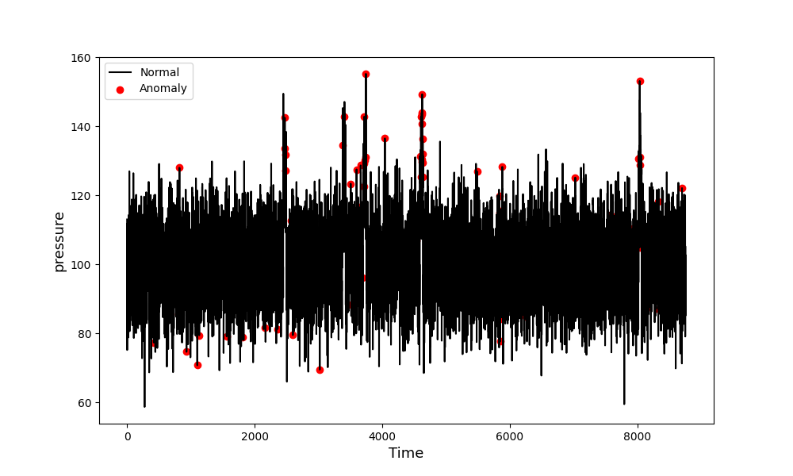
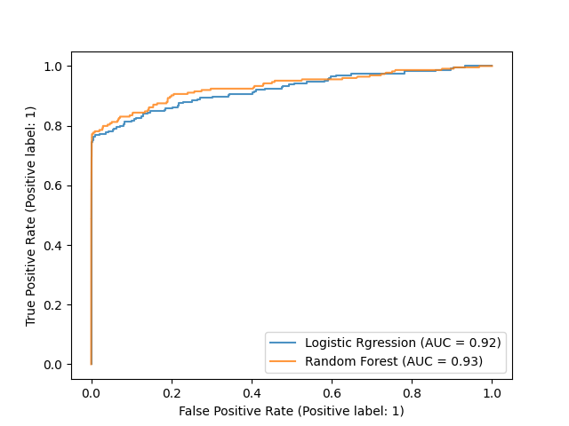
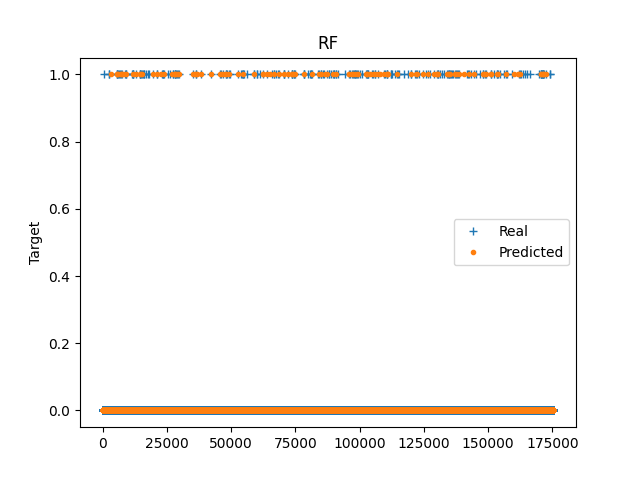
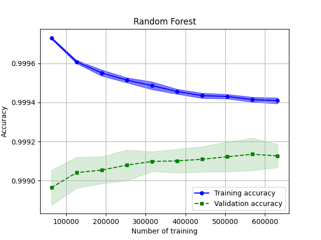

# Predictive Maintenance

The data used over one hundred machines and consisting of:
- Sensor data, such as Pressure, Voltage, Rotation, and Vibration
- Failure and Maintenance history
- Machine logs such as error types.

Two classes of models are developed:
- Anomaly detection using unsupervised machine learning algorithms: Isolation Forest and AutoEncoder

For more details on anomaly detection, the readers are referred to https://github.com/jvachier/Anomaly-Detection-From-Decision-Tree-to-Generative-Model
- Prediction using supervised machine learning algorithms: Logistic Regression and Random Forest

## Repository Structure

    .
    ├── README.md 
    ├── poetry.lock
    ├── pyproject.toml
    ├── LICENCE
    ├── .gitignore
    ├── .github/
    └── src/                   
        ├── main.py         
        ├── modules/
        │   ├── data_prepration.py
        │   ├── loading.py
        │   └── models.py
        ├── pickle_files/
        ├── data/
        └── figures/ 

            
